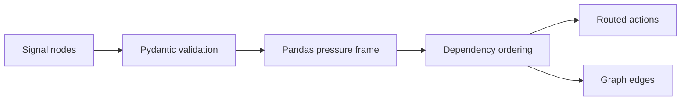

# Signal Orchestration Lab


## Executive Summary

Signal Orchestration Lab is a Python + FastAPI backend that
ingests cross-functional operating signals, models their dependencies, and
routes them into coordinated response plans. It is designed to feel like the
infrastructure brain behind growth systems, briefing surfaces, and executive
control rooms.

## Why It Matters

This repo demonstrates:

- Python backend breadth alongside the broader TypeScript portfolio
- FastAPI and Pydantic for production-style API design
- Pandas-backed pressure scoring and normalization
- orchestration logic that respects dependency chains instead of flat issue lists
- a backend architecture that feels operational, not academic

## Tech Stack

[](https://www.python.org/)
[](https://fastapi.tiangolo.com/)
[](https://docs.pydantic.dev/)
[](https://pandas.pydata.org/)
[](https://docs.pytest.org/)
[](https://opensource.org/license/mit)

## Overview

| Area | What it shows |
| --- | --- |
| Signal modeling | Revenue, growth, ops, security, AI, and customer signals modeled as dependency-aware nodes |
| Orchestration logic | Pressure scoring, deadline weighting, and dependency-aware sequence ranking |
| Graph outputs | Explicit upstream and downstream relationships for escalation planning |
| API surface | FastAPI endpoints for list, detail, graph analysis, orchestration analysis, and dashboard summary |
| Operational framing | Backend decisioning that supports executive reviews and control-plane products |

## Architecture


```

## Sample Request

```json
{
  "orchestration_id": "orch-demo",
  "scenario_name": "Northstar executive pressure map",
  "environment": "production",
  "nodes": [
    {
      "signal_id": "rev-coverage",
      "lane": "revenue",
      "title": "Pipeline coverage compression",
      "owner": "Revenue Operations",
      "metric": "coverage",
      "current_value": 2.1,
      "target_value": 3.0,
      "confidence": 0.86,
      "severity": "critical",
      "due_in_days": 8,
      "dependencies": ["growth-attribution", "ops-routing"],
      "note": "Coverage dip is being amplified by poor attribution confidence and delayed routing."
    }
  ]
}
```

## Sample Response

```json
{
  "status": "coordinated",
  "score": 61,
  "orchestration_headline": "Northstar executive pressure map should anchor on pipeline coverage compression before downstream pressure compounds.",
  "pressure_clusters": [
    "Revenue pressure: 1 linked signals",
    "Growth pressure: 1 linked signals"
  ],
  "routed_actions": [
    {
      "title": "Coordinate around pipeline coverage compression",
      "owner": "Revenue Operations",
      "lane": "revenue",
      "severity": "critical",
      "sequence_rank": 1,
      "due_in_days": 8,
      "rationale": "Pipeline coverage compression carries 2 downstream dependencies and pressure score 67.8."
    }
  ]
}
```

## Screenshots

### Hero


### Orchestration Graph


### Routed Actions


### Validation Proof


## Setup

```powershell
Set-Location "C:\Users\chaus\dev\repos\signal-orchestration-lab"
py -3.11 -m venv .venv
.venv\Scripts\Activate.ps1
python -m pip install .[dev]
uvicorn app.main:app --reload
```

Open:

- API docs: [http://127.0.0.1:8000/docs](http://127.0.0.1:8000/docs)

## Validation

```powershell
Set-Location "C:\Users\chaus\dev\repos\signal-orchestration-lab"
python -m pytest
python -m compileall app tests
```

## Portfolio Links

- [Kinetic Gain](https://kineticgain.com/)
- [LinkedIn](https://www.linkedin.com/in/mirzacausevic)
- [Skills / Portfolio](https://mizcausevic.com/skills/)
- [Medium](https://medium.com/@mizcausevic)
- [GitHub](https://github.com/mizcausevic-dev)
