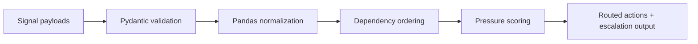

# Architecture

## Overview

Signal Orchestration Lab is a Python backend that turns disconnected operational
signals into a coordinated response graph. It demonstrates how backend systems
can reason about dependency order, urgency, and escalation instead of only
storing metrics.

## Flow

## Core Responsibilities

- normalize multi-lane operating signals
- calculate pressure and deadline-driven urgency
- respect dependency chains between signals
- return ordered actions instead of flat issue lists
- expose orchestration and graph endpoints through FastAPI

## Why This Repo Exists

This project is meant to show the infrastructure layer behind executive control
rooms and briefing systems. It answers a different question than analytics:
not just what is wrong, but what must happen first, by whom, and why.

